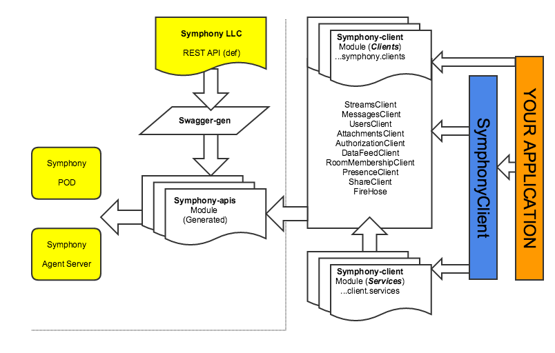
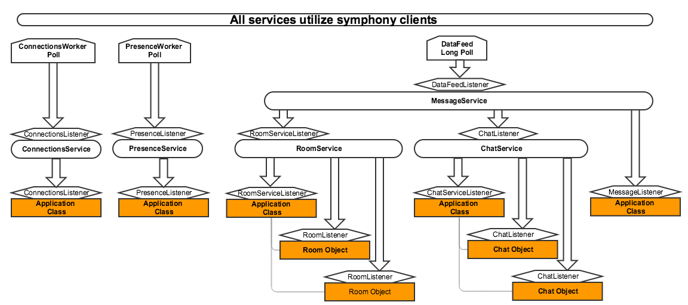

# Symphony Java Client

The Symphony java client provides a real-time wrapper around the Symphony REST API's to simplify the creation of chat sessions, room access, presence, messaging and more... The client provides a set of logical services representing supported features of the Symphony platform. Services support real-time events through feature based listeners and communication objects. Access is not limited to the services as all underlying Symphony client implementations are exposed for advanced use or creation of your own service.

The goal is to get developers to focus on functional development vs the scaffolding required to establish and communicate over the network.

This documentation will attempt to break down each part of the SDK in order to help users understand and use the services provided. 

## API DOC

[API DOC](https://symphonyoss.github.io/symphony-java-client/index.html)

## SJC Basic Design Overview

The SJC design is based on three layers.

* Symphony LLC REST API generated endpoints and models.  These should be treated as primitives in terms of Symphony network communications and supported actions.
* SJC Clients abstract the generated endpoints and models (including versions) to provide a concise set of SDK features that are assembled by calling one or more generated endpoints. In simple terms, clients provide functional methods that are linked to common unified communications actions.  Examples streamsClient.sendMessage(aMessage) or presenceClient.getUserPresence(id)
* SJC Services provide higher level abstractions to support real-time capabilities within a BOT application.  In essence, services provide all the scaffolding to manage Chat, Room, Presence, and general message features.  This allows the developer to focus on use cases vs worrying about all the underlying mechanics. All services leverage SJC clients to communicate with Symphony POD and Agent network components.  It's highly recommended that services be uses vs lower level client implementations.  

Nothing prevents a developer from using any layer directly, but it's highly recommended to use services vs lower level client implementations.

The following diagram provides a high level design overview:

## Services Design Overview

Services utilize listeners and context based object models to create real-time capabilities.  Each service will leverage SJC client classes to make the necessary underlying calls to Symphony.  

In certain cases such as Message, Chat and Room services dependancies are created to support a natural hierarchy.  For instance, MessageService creates a long poll using the DataFeedClient to consume all new messages in real-time. When the MessageService receives a new message, it will verify message type and dispatch to the appropriate listening service.  Currently the ChatService and RoomService utilize the MessageService to receive new messages (events). 

The Chat and Room services utilize context based objects, such as Chat and Room to support multiple conversations at any given time. These objects are registered with their respective service and maintain internal listeners which receive message callbacks.

Bot Chat and Room services can automatically construct these objects based on externally initiated traffic to the BOT.  In simple terms listeners support onNewChat and onNewRoom, which are triggered if and when there is an new incoming message.

The MessageService also supports a general MessageListener callback for applications that are looking to consume all traffic. 

## SymphonyClient - Making it easy..

The **SymphonyClient** class (org.symphonyoss.client.SymphonyClient) is a wrapper interface for both clients and services.

This wrapper requires SymAuth object with valid key/session tokens, email of the BOT user and URLs for the POD and Agent Server.  

The SJC comes with a single implementation that can be instantiated from the **SymphonyClientFactory**. 
    
    SymphonyClientFactory.getClient(SymphonyClientFactory.TYPE.BASIC)

The implementation is called **SymphonyBasicClient**.  Initializing this implementation will automatically create all underlying clients and services.  This means your application would be actively connecting and processing all new messages from Symphony POD (through Agent Server).  

In the event you want to only initialize specific clients and services, implement the SymphonyClient interface directly.  

Example of instantiating the client below: (see [Creating a session](https://github.com/symphonyoss/symphony-java-client/wiki/Creating-a-session) to create SymAuth)

     try {
            //Create a bootstrap configuration, which will load properities for you..
            SymphonyClientConfig symphonyClientConfig = new SymphonyClientConfig(true);

            //
                        
            //Create a basic client instance
            SymphonyClient symClient = SymphonyClientFactory.getClient(SymphonyClientFactory.TYPE.V4, symphonyClientConfig);

        } catch (InitException e) {
            logger.error("error", e);
        }

Once initiated the SymphonyClient can be used to access all clients and services.

Next topic: [Creating a session](https://github.com/symphonyoss/symphony-java-client/wiki/Creating-a-session)
